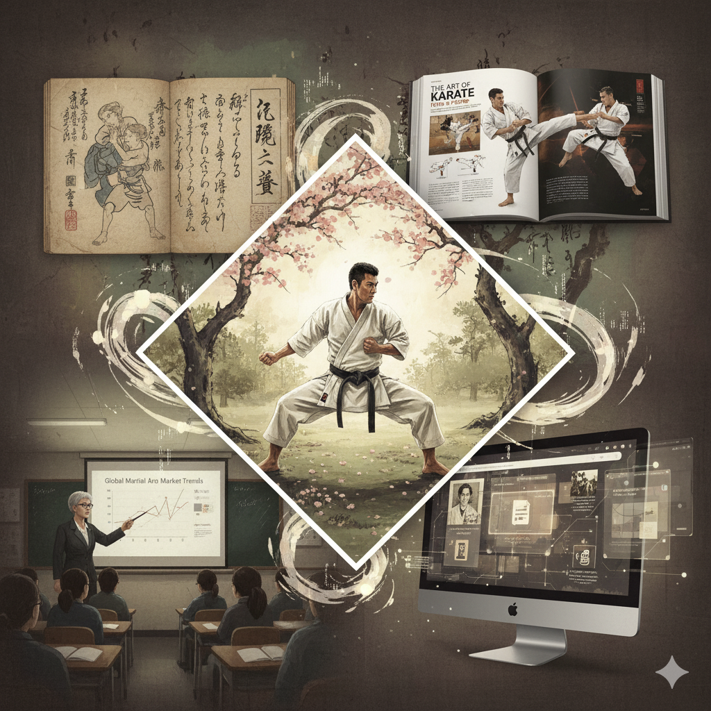

# Martial Arts Literature Guide

[](http://creativecommons.org/publicdomain/zero/1.0/)
[](https://github.com/GizzZmo/martial_arts/releases)
[](https://github.com/GizzZmo/martial_arts/actions/workflows/ci.yml)
[](https://github.com/GizzZmo/martial_arts/actions/workflows/deploy.yml)
[](https://github.com/GizzZmo/martial_arts/actions/workflows/screenshots.yml)

**A comprehensive guide to martial arts libraries, archives, publishers, journals, and essential books.**

The pursuit of knowledge in the martial arts is a journey enriched by its vast and varied literary landscape. This project maps the key resources available to practitioners, researchers, and historians.



---

## Words from the Author

My name is **Jon-Arve Constantine Grønsberg-Ovesen**. I care about the places where discipline, history, and the written word meet—and few fields hold that intersection as tightly as the martial arts. What began as a practical hunger to find *reliable* books, treatises, and archives grew into this guide: a map of libraries, publishers, journals, and primary sources that I wished had existed when I first tried to orient myself in a landscape that is equal parts profound and noisy.

I am not writing from a pedestal of institutional authority. I write as someone who has spent long evenings following footnotes into Fechtbücher and Bubishi commentaries, comparing translations of Musashi, chasing catalog entries from the Kodokan to Wiktenauer, and learning—sometimes the hard way—which “must-read” titles are canonical and which are merely well marketed. Along the way I kept notes. Those notes became lists; the lists became sections; the sections became this site. If the tone is careful, it is because the literature deserves care. If the tone is personal, it is because the search itself has been personal: a way of understanding how people across centuries tried to preserve skill, ethics, and strategy on the page.

**Art, science, and technology** are the three threads that run through how I work. Martial arts literature sits naturally at their crossing—illustrated manuscripts and modern sport science, philology and practical reconstruction, open digital archives and the stubborn materiality of a well-printed book. I prefer sources that can be checked, editions that name their translators, and institutions that open their catalogs even when they cannot open every shelf.

This project is dedicated to the public domain under **CC0 1.0**. Corrections and additions are welcome.

**Full personal note:** [`author.html`](author.html)

**Contact**
- **Name:** Jon-Arve Constantine Grønsberg-Ovesen
- **GitHub:** [@GizzZmo](https://github.com/GizzZmo)
- **Phone:** [+47 478 20 914](tel:+4747820914)

---

## Quick Start

No installation required. This is a static website.

1. **Clone or download** the repository
2. Open `index.html` in any modern browser

```bash
git clone https://github.com/GizzZmo/martial_arts.git
cd martial_arts
# then open index.html
```

Or browse the [GitHub repository](https://github.com/GizzZmo/martial_arts). After enabling GitHub Pages (see below), the live site will be at:

**https://gizzzmo.github.io/martial_arts/**

---

## Deployment (GitHub Pages)

Deployment is automated via [`.github/workflows/deploy.yml`](.github/workflows/deploy.yml).

### One-time setup
1. Open **Settings → Pages**
2. Under **Build and deployment → Source**, choose **GitHub Actions**
3. Push to `main` (or run the **Deploy to GitHub Pages** workflow manually under the Actions tab)

The workflow packages all `*.html` pages plus root images / optional asset folders into a Pages artifact and deploys it. Relative links between pages continue to work under the `/martial_arts/` path prefix.

### Manual / offline package
Every CI run also uploads a **martial-arts-site** artifact (zip + tar.gz) you can download from the Actions run page for mirrors or local hosting.

---

## CI, assets, artifacts & screenshots

| Workflow | Trigger | What it does |
|----------|---------|----------------|
| **[CI](.github/workflows/ci.yml)** | push / PR to `main` | Validates required pages, HTML sanity checks, inventory of image assets, relative-link warnings; packages site as downloadable artifact |
| **[Deploy](.github/workflows/deploy.yml)** | push to `main` / manual | Builds static package → GitHub Pages |
| **[Screenshots](.github/workflows/screenshots.yml)** | HTML changes, weekly cron, manual | Serves site locally, captures desktop + mobile full-page PNGs with Playwright, uploads **page-screenshots** artifact |

Screenshot script: [`scripts/screenshots.mjs`](scripts/screenshots.mjs).

---

## Usage Examples

### Jump straight to a specific section

| Goal | Open this file |
|------|----------------|
| Read the author’s personal note | [`author.html`](author.html) |
| Find digital archives + direct primary-source links | [`libraries-archives.html`](libraries-archives.html) |
| Discover specialist publishers | [`publishers.html`](publishers.html) |
| Look up academic journals & bibliographies | [`scholarship.html`](scholarship.html) |
| Browse curated essential books | [`book-compendium.html`](book-compendium.html) |
| Prefer a wiki-style layout | [`wiki.html`](wiki.html) |

---

## What's Inside

| Section | Description | File |
|---------|-------------|------|
| **Author** | Personal words from Jon-Arve Constantine Grønsberg-Ovesen | [author.html](author.html) |
| **Introduction** | The indispensable role of text in martial traditions | [introduction.html](introduction.html) |
| **Libraries & Archives** | Institutional libraries, digital archives, and direct primary-source links | [libraries-archives.html](libraries-archives.html) |
| **Publishers** | Specialist and academic publishers | [publishers.html](publishers.html) |
| **Scholarship** | Journals, magazines, and bibliographies | [scholarship.html](scholarship.html) |
| **Book Compendium** | Historical treatises, masters, and scholarly works | [book-compendium.html](book-compendium.html) |
| **Building Your Library** | Practical collecting advice | [building-library.html](building-library.html) |
| **Conclusion** | Summary and future directions | [conclusion.html](conclusion.html) |
| **Industry Trends** | Publishing and literature landscape | [martial_arts_industry_trends.html](martial_arts_industry_trends.html) |
| **Wiki View** | Section hub | [wiki.html](wiki.html) |

---

## License

This work is dedicated to the public domain under **[CC0 1.0 Universal](LICENSE)**.

---

## Author

**Jon-Arve Constantine Grønsberg-Ovesen** ([@GizzZmo](https://github.com/GizzZmo))

Phone: [+47 478 20 914](tel:+4747820914)

Art, science and technology.
